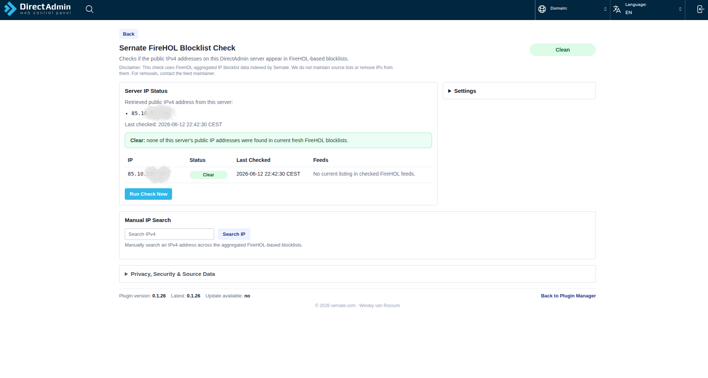
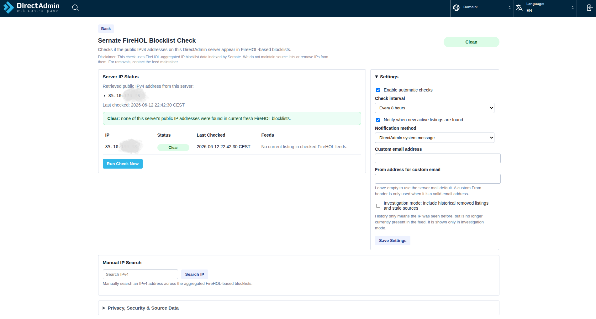
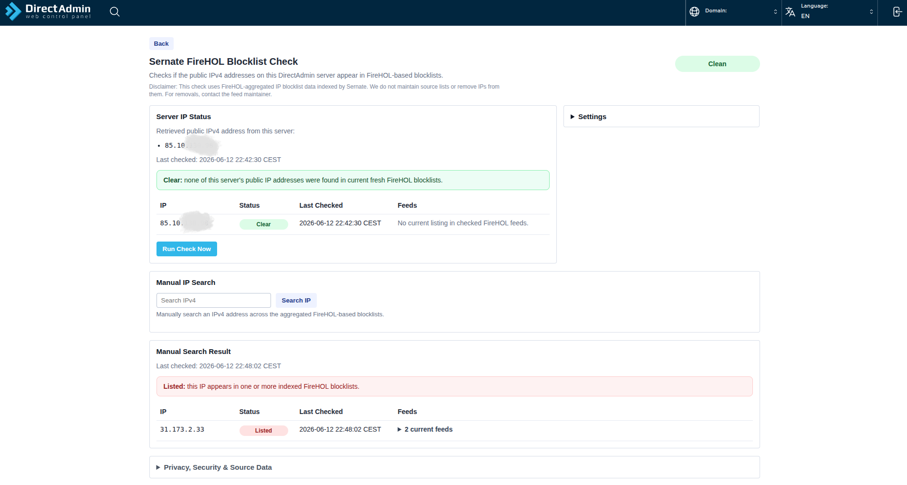
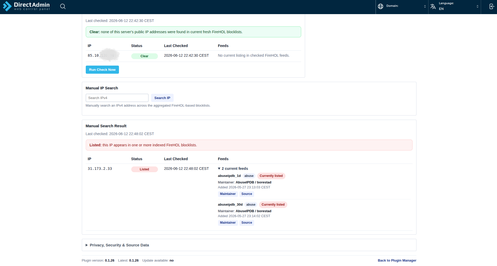

# Sernate FireHOL Blocklist Check

DirectAdmin admin plugin for checking whether a server's public IPv4 addresses appear in FireHOL-based blocklists indexed by the Sernate Blocklist API.

The plugin is meant to answer a simple operational question inside DirectAdmin:

**Are any public IP addresses on this server currently listed in indexed FireHOL-based blocklists?**

It can help when checking server IP reputation, looking into abuse reports, reviewing suspicious IPs from access logs, or troubleshooting possible issues with mail delivery or blocked outbound connections.

The manual search is useful when you see an IP repeatedly attacking or probing a server. You can look it up to see if it appears in any indexed FireHOL-based feeds. If only certain feeds list the IP, that may help decide which source lists are worth monitoring or adding to firewall tools such as ConfigServer Firewall.

## Why Use This DirectAdmin Plugin Beside CSF RBL Checks?

CSF's RBL check is mainly useful for mail blacklist checks and email delivery issues.

This DirectAdmin plugin checks FireHOL-based IP blocklists, which cover broader security signals such as scanners, abuse, malware, botnets and attack sources.

It does not replace CSF and does not change firewall rules. It gives extra visibility.

## What It Does

- Detects public IPv4 addresses on the DirectAdmin server.
- Checks those IPs against FireHOL-based blocklist data indexed by Sernate.
- Shows whether each IP is clear, currently listed, or only present in historical results.
- Shows affected feeds, feed maintainers, source links, categories and timestamps where available.
- Includes optional manual IP search.
- Supports automatic checks every 8, 12 or 24 hours.
- Can notify the DirectAdmin admin or a custom email address when new active listings are found.

## What It Does Not Do

- It does not block or unblock IP addresses.
- It does not modify CSF, firewalld, iptables, nftables or other firewall rules.
- It does not modify DirectAdmin settings.
- It does not contact feed maintainers or request removals.
- It does not guarantee email deliverability.
- It does not directly monitor Gmail, Microsoft or mailbox-provider reputation systems.

The plugin is read-only. It provides visibility and investigation context.

## Understanding Blocklist Results

A listing in one or more FireHOL-based blocklists does not automatically mean that a server is compromised, abusive or experiencing service issues.

FireHOL aggregates many different threat intelligence sources, each with its own methodology, confidence level, scope and purpose. Some feeds are selective and list confirmed malicious activity, while others include broader categories such as scanners, proxies, VPNs, cloud infrastructure, previously reported hosts or historical observations.

As a result:

- Not all blocklists carry the same weight or reputation.
- Different providers and services use different threat intelligence sources.
- A listing does not necessarily mean a service will block your IP.
- A listing only matters operationally when a service, provider or administrator actually uses that specific feed or a related source.
- An IP may appear in one feed while remaining fully functional for email, APIs and other services.
- Some listings may be informational rather than immediately actionable.

The purpose of this plugin is to show where server IP addresses appear within indexed threat intelligence feeds. Treat results as an indicator for further investigation, not as a final verdict on reputation, trustworthiness or service availability.

When a listing is detected, review the affected feed, maintainer, category and source before deciding what action is needed.

## Screenshots

|  |  |
| --- | --- |
| **Server IP status**<br> | **Settings**<br> |
| **Clean overview**<br> | **Manual search result**<br> |

## Download

Download the latest plugin package:

https://github.com/WeszNL/directadmin-firehol-ip-blocklist-check/releases/latest

Use this file from the latest release:

```text
sernate_firehol_blocklist_check.tar.gz
```

## Install

Install the downloaded package through the DirectAdmin Plugin Manager:

1. Log in to DirectAdmin as an admin user.
2. Open **Plugin Manager**.
3. Upload `sernate_firehol_blocklist_check.tar.gz`.
4. Install the uploaded plugin.
5. Open **Sernate FireHOL Blocklist Check** from **Extra Features**.

The plugin is admin-only. Reseller and user level pages are not used for the actual feature.

## Privacy & Security

The plugin sends only the selected IPv4 address(es) to the Sernate blocklist lookup API at https://blocklist.sernate.com. API documentation is available at https://blocklist.sernate.com/docs.

It does not send DirectAdmin login details, usernames, domains, email addresses, server configuration, logs, files or customer data.

Like any tool that uses an external API, there is some trust involved if that source is unavailable or returns unexpected data. API responses are treated as untrusted text: returned values are escaped or validated before display and are never used to run server commands.

## Source Data

[FireHOL](http://iplists.firehol.org/) and the upstream feed maintainers deserve credit for collecting, curating and maintaining the source blocklist data.

Sernate provides the hosted API, indexing, history, freshness checks and this DirectAdmin plugin. Removal requests must go to the maintainer of the source list where the IP appears.
